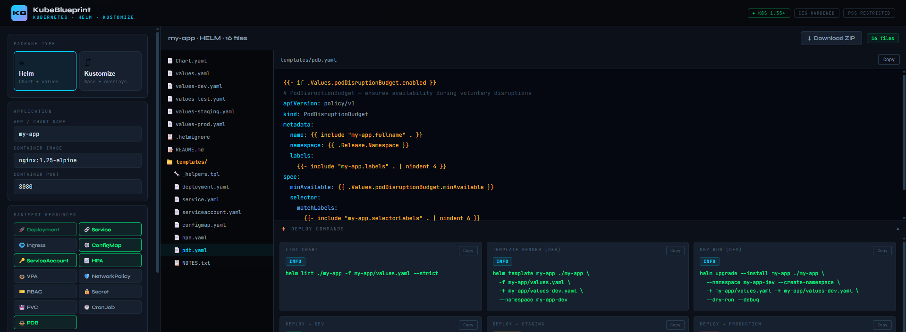

# KubeBlueprint



A web-based tool for generating Kubernetes manifests using Helm and Kustomize. KubeBlueprint simplifies Kubernetes deployments by providing an intuitive interface to create production-ready configuration files with security, scaling, and advanced features out of the box.

## Features

- **Multiple Package Types**: Support for both Helm charts and Kustomize overlays
- **Security Controls**: Built-in security configurations including:
  - Non-root user enforcement
  - Read-only root filesystem
  - Capability dropping
  - Seccomp profiles
  - Network policies
  
- **Environment Management**: Multi-environment deployment support (dev, staging, prod)
- **Advanced Scaling**: KEDA integration for event-driven autoscaling with support for:
  - Kafka
  - RabbitMQ
  - Redis
  - AWS SQS
  - Prometheus
  - Cron

- **Service Mesh**: Istio integration for traffic management
- **Secret Management**: Built-in support for various secret storage backends
- **Manifest Resources**: Configurable Kubernetes resources including:
  - Deployments
  - Services
  - ConfigMaps
  - ServiceAccounts
  - And more

## Prerequisites

- Go 1.22 or higher
- Docker (for containerized deployment)
- make (optional, for using Makefile commands)

## Installation & Setup

### Clone the Repository

```bash
git clone https://github.com/yourusername/KubeBlueprint.git
cd KubeBlueprint
```

### Install Dependencies

```bash
go mod download
```

## Usage

### Running with `go run`

Start the application with default port (8080):

```bash
go run main.go
```

The application will start and display:

```
╔══════════════════════════════════════════╗
║  KubeBlueprint                           ║
║  http://localhost:8080                   ║
╚══════════════════════════════════════════╝
```

Open your browser and navigate to `http://localhost:8080` to access the web interface.

### Running with Docker

Build the Docker image:

```bash
docker build -t kubeblueprint:latest .
```

Run the container:

```bash
docker run -p 8080:8080 kubeblueprint:latest
```

Access the application at `http://localhost:8080` (or your specified port).

### Using Makefile

If available, you can use the Makefile for convenient commands:

```bash
make build    # Build the Docker image
make run      # Run the application locally
make test     # Run tests
```

## Project Structure

```
.
├── main.go                 # Application entry point
├── Dockerfile              # Docker container configuration
├── go.mod                  # Go module dependencies
├── Makefile               # Build automation
├── README.md              # This file
│
├── cmd/
│   └── server/
│       └── main.go        # Server implementation
│
├── internal/
│   ├── handlers/
│   │   └── handlers.go    # HTTP request handlers
│   ├── generator/
│   │   ├── helm.go        # Helm manifest generation
│   │   └── kustomize.go   # Kustomize overlay generation
│   └── models/
│       └── models.go      # Data models and schemas
│
├── static/
│   ├── css/
│   │   └── app.css        # Application styles
│   └── js/
│       └── app.js         # Frontend JavaScript
│
└── templates/
    └── index.html         # Web interface template
```

## License

This project is licensed under the MIT License - see the LICENSE file for details.

## Support

For issues, questions, or suggestions, please open an issue on GitHub.

---

**Happy deploying with KubeBlueprint! 🚀**
